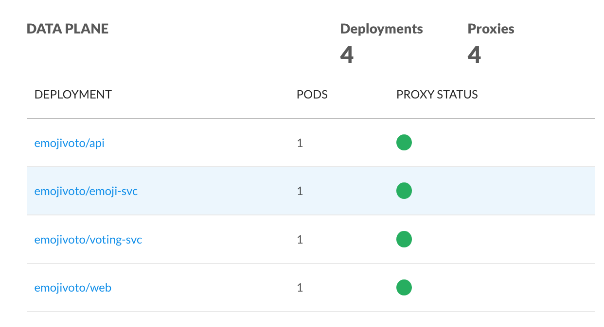

+++
title = "Adding your service to the mesh"
docpage = true
[menu.docs]
  parent = "adding-your-service"
+++

In order for your service to take advantage of Conduit, it needs to be added
to the service mesh. This is done by using the Conduit CLI to add the Conduit
proxy sidecar to each pod. By doing this as a rolling update, the availability
of your application will not be affected.

## Prerequisites

* Applications that use WebSockets or HTTP tunneling/proxying (use of the HTTP
  `CONNECT` method), or plaintext MySQL, SMTP, or other protocols where the server
  sends data before the client sends data, require additional configuration. See
  the [Protocol Support](#protocol-support) section below.
* gRPC applications that use grpc-go must use grpc-go version 1.3 or later due
  to a [bug](https://github.com/grpc/grpc-go/issues/1120) in earlier versions.
* Conduit doesn't yet support external DNS lookups (e.g. proxying a call to a
  third-party API). This will be addressed in an [upcoming
  release](https://github.com/runconduit/conduit/issues/155).

## Adding your service

### To add your service to the service mesh, run:
#### `conduit inject deployment.yml | kubectl apply -f -`

`deployment.yml` is the Kubernetes config file containing your
application. This will trigger a rolling update of your deployment, replacing
each pod with a new one that additionally contains the Conduit sidecar proxy.

You will know that your service has been successfully added to the service mesh
if its proxy status is green in the Conduit dashboard.

### You can always get to the Conduit dashboard by running
#### `conduit dashboard`

## Protocol Support

Conduit supports most applications without requiring any configuration on your
part. To accomplish this, Conduit automatically detects the protocol used on
each connection. In some cases, however, Conduit's protocol detection can't be
fully automated and requires some configuration from you.

### HTTP Tunneling and WebSockets

Most HTTP traffic (including HTTP/2) will be handled automatically and
transparently by Conduit without any configuration on your part. However,
non-HTTPS WebSockets and HTTP tunneling/proxying (use of the HTTP `CONNECT`
method) currently require manual configuration to disable the layer 7 features
for those connections. For pods that accept incoming `CONNECT` requests and/or
incoming WebSocket connections, use the `--skip-inbound-ports` flag when running
`conduit inject`. For pods that make outgoing `CONNECT` requests and/or outgoing
WebSocket connections, use the `--skip-outbound-ports` flag when running
`conduit inject`. (Automatic transparent proxying of WebSockets will be
implemented in a [future release](https://github.com/runconduit/conduit/issues/195).)

### For example, to allow inbound traffic on ports 80 and 7777 to bypass the proxy, use the command:
#### `conduit inject deployment.yml --skip-inbound-ports=80,7777 | kubectl apply -f -`

### MySQL and SMTP

Most non-HTTP traffic will also be handled automatically and transparently by
Conduit without any configuration on your part. However, for protocols where the
server sends data before the client sends, e.g. MySQL and SMTP connections that
aren't protected by TLS, Conduit currently requires some manual configuration.
In such cases, use the `--skip-inbound-ports` flag when running `conduit
inject`. For pods that make outgoing connections using such protocols, use the
`--skip-outbound-ports` flag when running `conduit inject`. (Note that this
applies only to non-TLS'd connections; connections with TLS enabled do not
require any additional configuration irrespective of protocol.)

### For example, to allow outbound traffic to port 3306 (MySQL) to bypass the proxy, use the command:
#### `conduit inject deployment.yml --skip-outbound-ports=3306 | kubectl apply -f -`
